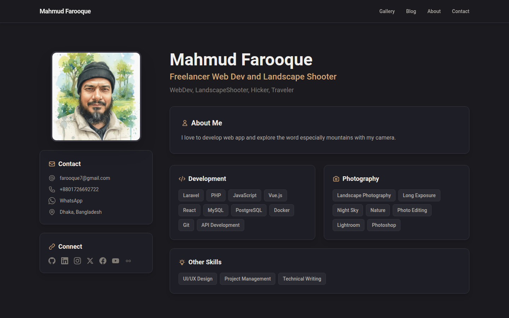
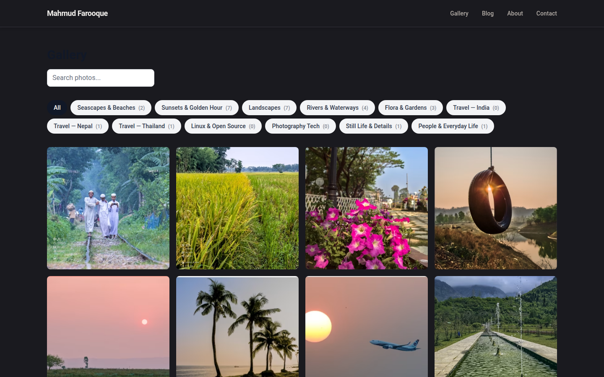

# mfaruk.com — Photography Portfolio & CV Platform

A full-stack photography portfolio, blog and CV website, designed, built and run in production by **Mahmud Farooque**. It is built on **Laravel 13** with a **Vue 3 + Inertia.js** front end rendered on the server.

**Live site:** [mfaruk.com](https://mfaruk.com) · **Author:** [Mahmud Farooque](https://www.linkedin.com/in/mmhfarooque)



## Highlights

- **Laravel 12 → 13 upgrade in production**: brought 38 Composer and 12 npm security vulnerabilities down to zero, then checked the live site URL by URL.
- **Image delivery pipeline**: a routed image endpoint (`/img/{slug}/{variant}-{width}.{format}`) serves responsive WebP/AVIF variants, with BlurHash placeholders and automatic watermarking.
- **Photo intelligence**: reads camera settings and GPS from each photo's EXIF data, shows photos on a map, and syncs edits from Lightroom (XMP files).
- **Cloud storage**: photos are stored on Cloudflare R2 (S3-compatible) through Laravel's Flysystem.
- **Commerce**: print ordering with Printful and licensed digital downloads, paid through Stripe.
- **SEO tooling**: a built-in SEO audit dashboard, Google Search Console integration, XML and image sitemaps, and an RSS feed.
- **Admin dashboard**: 23 admin controllers covering photos, galleries, categories, tags, blog posts (Editor.js), equipment, analytics and site themes.
- **Production operations**: self-managed Debian server, a systemd-managed SSR service and a scripted deploy chain.
- **AI-assisted engineering**: developed with Claude Code agents under my direction. I own the architecture, review, testing and deployment; [`CLAUDE.md`](CLAUDE.md) holds the project context the agents work from.



## Tech Stack

| Layer | Technology |
|-------|------------|
| Backend | Laravel 13 (PHP 8.3+, production on PHP 8.4) |
| Front end | Vue 3 (Composition API), Inertia.js 2 with SSR, Tailwind CSS, Ziggy |
| Database | MySQL / MariaDB |
| Images | Intervention Image 4, WebP/AVIF variants, BlurHash |
| Storage | Cloudflare R2 via Flysystem (S3) |
| Integrations | Stripe, Printful, Google APIs (Search Console) |
| Build | Vite 7 |
| Hosting | Debian + HestiaCP, systemd SSR service |

## Quick Start

```bash
composer install
npm install

cp .env.example .env
php artisan key:generate

php artisan migrate --seed

npm run build
php artisan serve
```

## Project Structure

```
app/
├── Http/Controllers/   # Public site, checkout, sitemaps, feeds
│   └── Admin/          # Admin dashboard controllers
├── Services/           # Image variants, EXIF/Lightroom sync, SEO audit, payments, prints
├── Models/ Jobs/ Observers/ Policies/
resources/js/
├── Pages/              # Inertia page components (public + admin)
├── Components/ Layouts/ composables/
└── ssr.js              # Server-side rendering entry
routes/
├── web.php             # Site and admin routes
└── images.php          # Routed image delivery (kept outside the web middleware group)
deploy/                 # Deploy script and systemd SSR unit
```

## Documentation

- [DEVELOPMENT.md](DEVELOPMENT.md): development guidelines and patterns
- [DEPLOYMENT.md](DEPLOYMENT.md): deployment guide
- [docs/reference/](docs/reference/): architecture, operations and gotchas
- [docs/internal/](docs/internal/): historical build notes and task logs

## License

This project is proprietary software. The source is published for portfolio review only.
